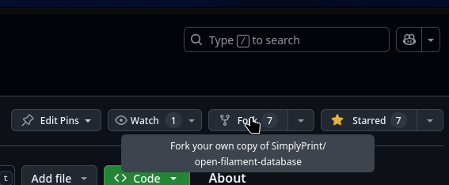
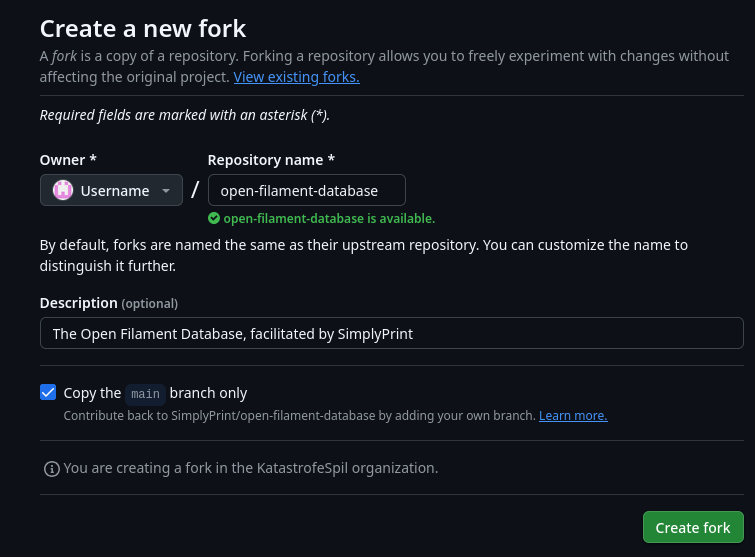

# To fork a repository
So to fork our repository you'll need to open it in your web browser, you can then find the "Fork" button in the top right of the page, on the other side of the name below the search
  
You'll get redirected to a menu where you can fork the repository, if the owner menu says "Choose an owner" please click it and select yourself, then click "Create fork"
  

You should now be looking at the same page again except your name has replaced SimplyPrint in the top left!