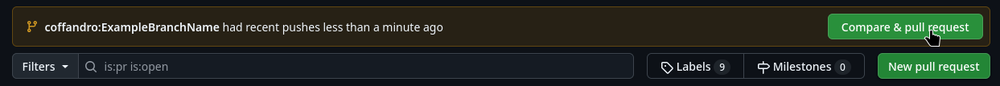
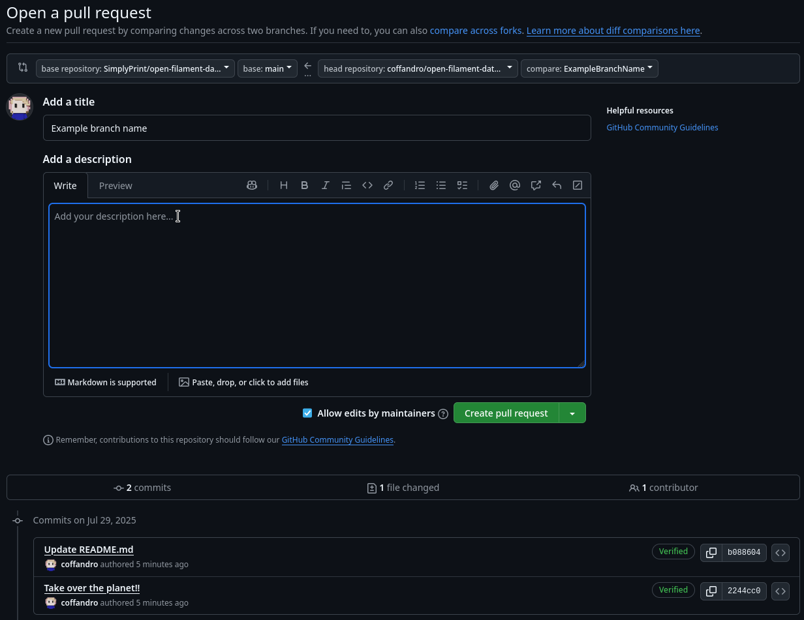

# Pull requesting
To make a pull request we assume you have your data in the cloud already so let's get started!

To begin with we'll go to this link, the pull requests tab of the main database
https://github.com/SimplyPrint/open-filament-database/pulls
If you've pushed a yellowish banner will appear, click the compare and pull request button.

You should be brought to a page that looks like this, simply change the title to whatever describes what you've changed and write a short description about the same

When you're ready press the `Create pull request` button and wait for someone to come merge it, or be ready for some feedback \:D